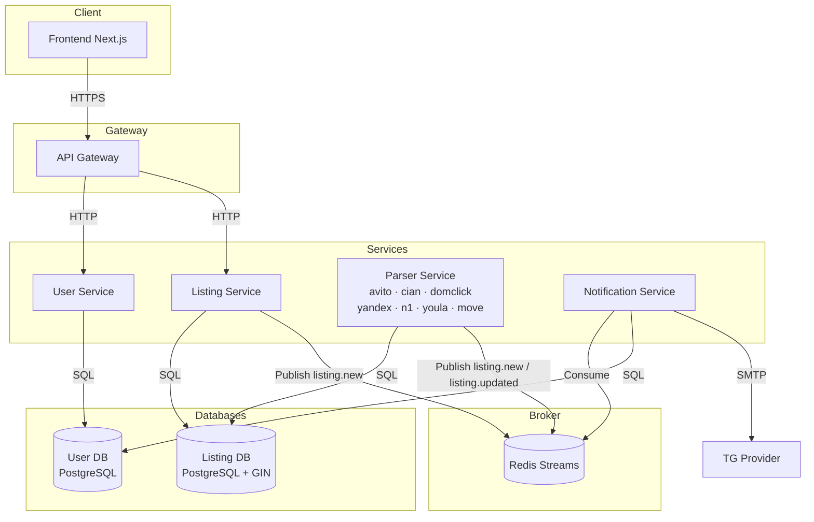
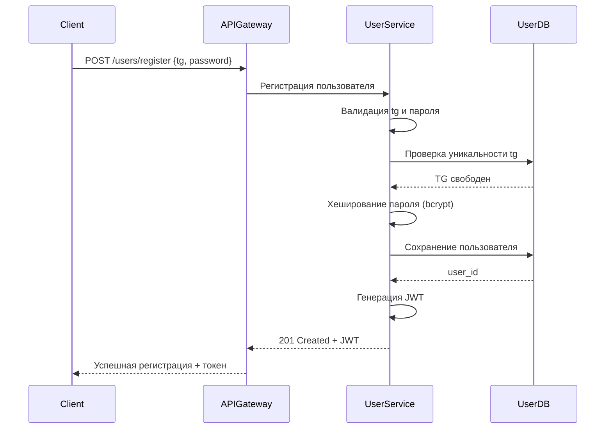
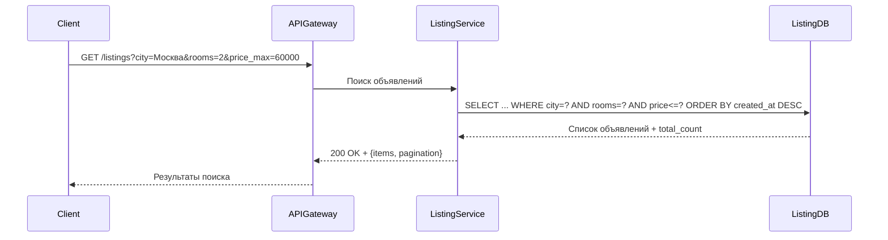
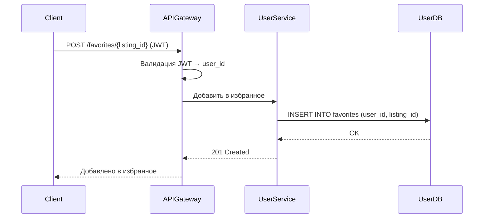
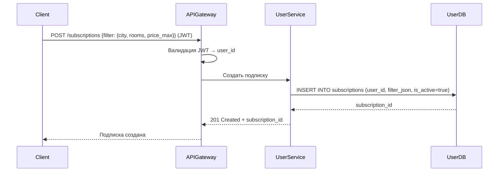
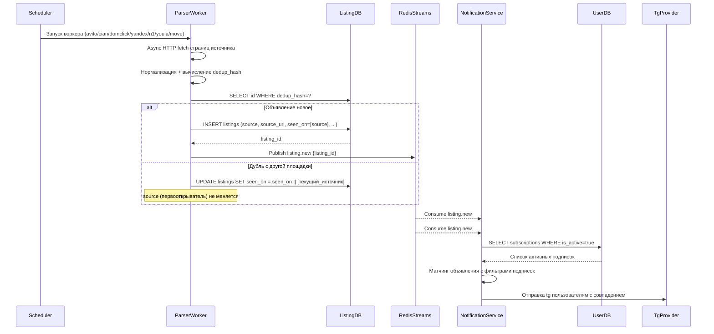
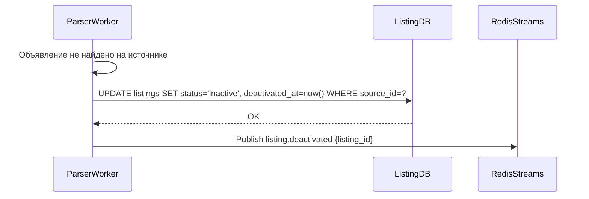
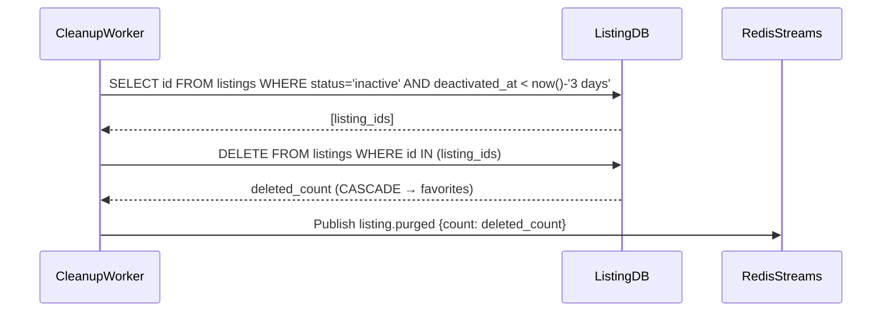

# Техническое решение проекта «Асинхронный сервис поиска аренды жилья»


## Введение

**Описание:**
Данный проект реализует асинхронный веб-сервис для поиска аренды жилья. Система автоматически агрегирует объявления с крупнейших площадок (Авито, ЦИАН, Яндекс.Недвижимость, Домклик - об этом позже) через фоновые парсеры, запускаемые каждые 2–5 минут, и предоставляет пользователям единый интерфейс для поиска, фильтрации, сохранения избранного и получения уведомлений о новых объявлениях. Архитектура построена на принципах микросервисов с асинхронной обработкой данных и событийной шиной для взаимодействия между сервисами.

**Цель:**
Разработать прототип асинхронного агрегатора объявлений об аренде жилья с поддержкой фильтрации, уведомлений, истории поиска и актуальной базой объявлений в реальном времени.

**Задачи:**
- Реализовать регистрацию и аутентификацию пользователей.
- Разработать асинхронный парсер объявлений с множественными источниками: 
- Обеспечить поиск и фильтрацию объявлений по цене, числу комнат, площади, районам, метро - с возможностью расширения функционала поиска по объявлениям.
- Реализовать сохранение избранных объявлений.
- Реализовать подписку на фильтры с push tg-уведомлениями при появлении новых объявлений по заанным критериям.
- Реализовать дедупликацию объявлений при сборе из нескольких источников.
- Обеспечить отображение объявлений на карте.
- Покрыть функциональность unit и интеграционными тестами.
- Подготовить техническую и пользовательскую документацию.


**Состав команды:**
- claude opus

## Глоссарий

| Термин               | Определение                                                                     |
|----------------------|---------------------------------------------------------------------------------|
| Пользователь         | Зарегистрированный клиент сервиса, ищущий жильё в аренду                       |
| Объявление           | Карточка арендуемого объекта с описанием, ценой, фото и контактами             |
| Источник             | Внешняя площадка, с которой собираются объявления: avito.ru, cian.ru, domclick.ru, realty.yandex.ru, n1.ru, youla.io, move.ru |
| Парсер               | Фоновый асинхронный воркер, собирающий объявления из одного источника          |
| Дедупликация         | Алгоритм определения одинаковых объявлений из разных источников; при совпадении сохраняется источник первого попадания |
| Источник-первооткрыватель | Площадка, с которой объявление попало в базу первой; отображается в UI и не меняется при обнаружении дубля на другой площадке |
| Фильтр-подписка      | Набор параметров поиска, при совпадении с которыми пользователь получает уведомление |
| Избранное            | Список объявлений, сохранённых пользователем                                   |
| API Gateway          | Входная точка для всех HTTP-запросов клиентов                                  |
| Parser Service       | Сервис фоновых асинхронных воркеров парсинга объявлений                        |
| Listing Service      | Сервис хранения, поиска и фильтрации объявлений                                |
| User Service         | Сервис регистрации, аутентификации и профилей пользователей                    |
| Message Broker       | Брокер сообщений для асинхронного взаимодействия сервисов (Redis Streams)      |
| JWT                  | JSON Web Token — токен аутентификации пользователя                             |

---

## Функциональные требования

### Регистрация и аутентификация
- Пользователь может зарегистрироваться, указав tg и пароль.
- Пользователь может войти в систему по tg и паролю.
- Все защищённые действия (избранное, подписки) доступны только после аутентификации.
- Авторизованный пользователь может просматривать и редактировать свой профиль.

### Поиск и фильтрация объявлений
- Пользователь может искать объявления по ключевым словам, городу, районам, метро.
- Пользователь может фильтровать объявления по: цене (мин/макс), числу комнат, площади, типу жилья (квартира, комната, дом), этажу, наличию мебели - тут нужно бует роработать интеллектуальную обработку содержимого страницы.
- Пользователь может сортировать результаты по цене, дате добавления, площади.
- Пользователь может видеть объявления на карте (географические координаты) - и карта обновляется каждые несколько минут.
- Система показывает источник объявления и дату последнего обновления и минимальную информацию о жилье.

### Избранное
- Авторизованный пользователь может добавить объявление в избранное.
- Пользователь может просмотреть список избранных объявлений.
- Пользователь может удалить объявление из избранного.

### Подписки и уведомления
- Авторизованный пользователь может создать подписку на фильтр поиска.
- При появлении нового объявления, соответствующего фильтру, пользователь получает tg-уведомление.
- Пользователь может управлять (создавать, просматривать, удалять) своими подписками.
- Пользователь может включить/выключить конкретную подписку без её удаления.

### Парсинг объявлений
- Система автоматически собирает объявления из источников каждые 2–5 минут.
- При повторном получении уже существующего объявления система обновляет его данные (цена, статус).
- Система дедуплицирует объявления из разных источников по `dedup_hash` (адрес + площадь + цена).
- При обнаружении дубля на другой площадке — новая запись **не создаётся**; в поле `seen_on` добавляется дополнительный источник, оригинальный `source` (источник-первооткрыватель) остаётся неизменным.
- В UI карточки объявления отображается оригинальный источник (бейдж площадки) и ссылка на неё; если объявление найдено на нескольких — показываются все ссылки.
- Объявления, снятые с площадки, помечаются как `inactive` с записью времени деактивации (`deactivated_at`).
- Объявления со статусом `inactive` автоматически удаляются из базы спустя 3 дня после деактивации (Cleanup Worker).
- При удалении объявления из Listing DB оно автоматически исчезает из избранного пользователей.

### Расширяемость парсинга
- Каждый источник реализован как отдельный модуль, наследующий абстрактный класс `BaseParser`.
- Поддерживаемые источники MVP: `avito.ru`, `cian.ru`, `domclick.ru`, `realty.yandex.ru`, `n1.ru`, `youla.io`, `move.ru`.
- Регистрация нового источника — добавление одного файла без изменений в других сервисах.
- Специфичные для источника данные хранятся в поле `extra_fields JSONB`, не ломая общую схему.
- Расписание воркеров задаётся через конфигурацию (`sources.yaml`), не в коде.

### Расширяемость поиска
- Фильтры реализованы через паттерн `QueryBuilder`: каждый фильтр — независимый класс, применяющий условие к запросу.
- Добавление нового фильтра (например, «наличие парковки») = один новый класс без изменения остального кода поиска.
- Интеллектуальная обработка содержимого страниц (извлечение атрибутов из описания) — опциональный пост-процессинг в парсере, подключаемый на уровне конфигурации источника.

---

## Ограничения

- MVP охватывает только аренду жилой недвижимости.
- Оплата и прямое бронирование — не нужно, просто переход на объявление.
- Push-уведомления в tg для MVP не реализованы.

---

## Нефункциональные требования

- **Доступность:** ≥ 99.5%
- **Время отклика API поиска:** ≤ 300 мс при ≤ 200 одновременных пользователях
- **Актуальность данных:** объявления обновляются не реже раза в 3 минуты
- **Горизонтальная масштабируемость:** Parser Workers и Listing Service масштабируются независимо
- **Отказоустойчивость:** при сбое одного воркера парсинга остальные продолжают работу
- **Безопасность:** пароли хранятся только в хэшированном виде (bcrypt)
- **Асинхронность:** все I/O операции (HTTP-запросы к источникам, БД, брокер) — неблокирующие (asyncio)
- **Расширяемость парсера:** добавление нового источника не требует изменений в существующих сервисах
- **Расширяемость поиска:** добавление нового фильтра не требует изменений в существующих обработчиках запросов

---

## Пользовательские сценарии (User Stories)

### Сценарий 1: Регистрация нового пользователя
1. Пользователь открывает форму регистрации, вводит tg и пароль.
2. Система проверяет уникальность tg, создаёт аккаунт.
3. Пользователь получает JWT и получает доступ к защищённым функциям.

### Сценарий 2: Поиск квартиры по фильтрам
1. Пользователь задаёт фильтры: город СПб, 2 комнаты, цена до 60 000 руб./мес.
2. Система возвращает список актуальных объявлений с пагинацией.
3. Пользователь переключается на карту и видит метки объявлений.

### Сценарий 3: Сохранение в избранное
1. Авторизованный пользователь открывает карточку объявления.
2. Нажимает «В избранное» — объявление появляется в его списке.
3. Пользователь переходит в «Избранное» и видит сохранённые объявления.

### Сценарий 4: Создание подписки на фильтр
1. Пользователь задаёт фильтр поиска и нажимает «Подписаться».
2. Система сохраняет подписку с параметрами фильтра.
3. При появлении нового объявления, соответствующего фильтру, пользователь получает в tg уведомление.

### Сценарий 5: Автоматический парсинг объявлений
1. Parser Service каждые 2–5 минут запускает воркеры для каждого источника.
2. Воркер собирает новые объявления, нормализует данные, проверяет дедупликацию.
3. Новые объявления сохраняются в Listing DB и публикуются событие `listing.new` в брокер.
4. Notification Service получает событие и проверяет, соответствует ли объявление активным подпискам.
5. Пользователи с совпадающими подписками получают tg.

### Сценарий 6: Обновление цены объявления
1. Воркер парсера получает объявление, уже существующее в базе, с изменённой ценой.
2. Система обновляет цену и дату изменения, публикует событие `listing.updated`.
3. Пользователи, добавившие объявление в избранное, могут видеть актуальную цену.

---

## Архитектура

### Описание

Архитектура построена на принципах микросервисов с асинхронным взаимодействием через брокер сообщений. Parser Service содержит набор независимых асинхронных воркеров (по одному на источник), которые периодически собирают объявления и публикуют события в Redis Streams. Listing Service индексирует объявления в PostgreSQL с полнотекстовым поиском. Notification Service потребляет события и проверяет соответствие активным подпискам.

**Основные компоненты:**
- **API Gateway**: единая точка входа, маршрутизация, валидация JWT.
- **User Service**: регистрация, аутентификация, профили, избранное, подписки; собственная БД.
- **Listing Service**: хранение, поиск и фильтрация объявлений; полнотекстовый индекс; собственная БД.
- **Parser Service**: 7 независимых асинхронных воркеров (avito.ru, cian.ru, domclick.ru, realty.yandex.ru, n1.ru, youla.io, move.ru); расписание через APScheduler.
- **Notification Service**: потребляет события из брокера, проверяет подписки, отправляет tg.
- **User DB**: PostgreSQL для пользователей, избранного и подписок.
- **Listing DB**: PostgreSQL + GIN-индекс для полнотекстового поиска объявлений.
- **Message Broker**: Redis Streams для асинхронных событий между сервисами.
- **Frontend (Next.js)**: клиентское SPA, взаимодействует с API Gateway по HTTPS.



---

## Технические сценарии

### Сценарий: регистрация нового пользователя

1. Клиент отправляет POST /users/register с tg и паролем
2. API Gateway перенаправляет запрос в User Service
3. User Service валидирует tg, проверяет уникальность в User DB
4. User Service хеширует пароль (bcrypt) и сохраняет пользователя
5. User Service генерирует JWT токен и возвращает его клиенту



---

### Сценарий: поиск объявлений с фильтрами

1. Клиент отправляет GET /listings?city=Москва&rooms=2&price_max=60000&page=1
2. API Gateway перенаправляет запрос в Listing Service
3. Listing Service формирует SQL-запрос с фильтрами, полнотекстовым поиском и пагинацией
4. Listing Service возвращает список объявлений с метаданными пагинации



---

### Сценарий: добавление объявления в избранное

1. Авторизованный клиент отправляет POST /favorites/{listing_id} с JWT
2. API Gateway валидирует токен и извлекает user_id
3. User Service проверяет существование объявления и сохраняет запись в избранное



---

### Сценарий: создание подписки на фильтр

1. Авторизованный клиент отправляет POST /subscriptions с параметрами фильтра
2. API Gateway валидирует токен
3. User Service сохраняет подписку как JSON-документ фильтра в User DB



---

### Сценарий: асинхронный парсинг, дедупликация и уведомление

1. APScheduler запускает 7 воркеров (avito, cian, domclick, yandex, n1, youla, move) каждые 2–5 минут
2. Воркер асинхронно собирает страницы источника (aiohttp), нормализует объявления
3. Для каждого объявления вычисляется `dedup_hash` = hash(address + area + price)
4. **Новое объявление** (хеш не найден): INSERT с `source` = текущая площадка, `seen_on = [source]`; событие `listing.new`
5. **Дубль** (хеш найден): UPDATE только `seen_on = seen_on || [текущая_площадка]`; оригинальный `source` не меняется; событие **не публикуется**
6. Notification Service потребляет `listing.new`, сверяет с подписками, отправляет tg



---

### Сценарий: деактивация объявления

1. Воркер парсера обнаруживает, что объявление снято с площадки (HTTP 404 или пропало из выдачи)
2. Parser Worker обновляет статус объявления на `inactive`, проставляет `deactivated_at = now()`
3. Объявление скрывается из результатов поиска, но остаётся в избранном с пометкой «снято»



---

### Сценарий: автоудаление устаревших неактивных объявлений (Cleanup Worker)

1. Cleanup Worker запускается раз в сутки (APScheduler, cron: `0 3 * * *`)
2. Выбирает все объявления со статусом `inactive` и `deactivated_at < now() - interval '3 days'`
3. Удаляет найденные записи; каскадно удаляются связанные записи в `favorites`
4. Публикует событие `listing.purged` с количеством удалённых объявлений для мониторинга



---

## Схема базы данных

### User DB

```sql
-- Пользователи
CREATE TABLE users (
    id          UUID PRIMARY KEY DEFAULT gen_random_uuid(),
    tg       TEXT UNIQUE NOT NULL,
    password_hash TEXT NOT NULL,
    created_at  TIMESTAMPTZ DEFAULT now()
);

-- Избранное
CREATE TABLE favorites (
    user_id     UUID REFERENCES users(id) ON DELETE CASCADE,
    listing_id  UUID NOT NULL,
    added_at    TIMESTAMPTZ DEFAULT now(),
    PRIMARY KEY (user_id, listing_id)
);

-- Подписки на фильтры
CREATE TABLE subscriptions (
    id          UUID PRIMARY KEY DEFAULT gen_random_uuid(),
    user_id     UUID REFERENCES users(id) ON DELETE CASCADE,
    filter_json JSONB NOT NULL,
    is_active   BOOLEAN DEFAULT true,
    created_at  TIMESTAMPTZ DEFAULT now()
);
```

### Listing DB

```sql
-- Объявления
CREATE TABLE listings (
    id           UUID PRIMARY KEY DEFAULT gen_random_uuid(),
    source       TEXT NOT NULL,           -- источник-первооткрыватель: 'avito' | 'cian' | 'domclick' | 'yandex' | 'n1' | 'youla' | 'move'
    source_id    TEXT NOT NULL,           -- ID объявления на источнике-первооткрывателе
    source_url   TEXT,                    -- прямая ссылка на объявление у источника-первооткрывателя
    seen_on      TEXT[] DEFAULT '{}',     -- все площадки, где встречалось (включая source)
    dedup_hash   TEXT UNIQUE,             -- хеш для дедупликации: hash(address + area + price)
    title        TEXT NOT NULL,
    description  TEXT,
    price        INTEGER,                 -- руб./мес.
    rooms        SMALLINT,
    area         NUMERIC(6,2),            -- м²
    floor        SMALLINT,
    city         TEXT,
    district     TEXT,
    address      TEXT,
    lat          NUMERIC(9,6),
    lon          NUMERIC(9,6),
    photos       TEXT[],
    status         TEXT DEFAULT 'active',   -- active | inactive
    deactivated_at TIMESTAMPTZ,             -- время деактивации; NULL для активных
    extra_fields   JSONB,                   -- специфичные поля источника (без изменений схемы)
    created_at     TIMESTAMPTZ DEFAULT now(),
    updated_at     TIMESTAMPTZ DEFAULT now(),
    search_vector  TSVECTOR                 -- для полнотекстового поиска
);

CREATE INDEX listings_city_rooms_price ON listings (city, rooms, price);
CREATE INDEX listings_search ON listings USING GIN (search_vector);
CREATE INDEX listings_status ON listings (status);
-- Индекс для Cleanup Worker: быстрый поиск устаревших неактивных объявлений
CREATE INDEX listings_inactive_deactivated ON listings (deactivated_at)
    WHERE status = 'inactive';
```

---

## API (OpenAPI overview)

### User Service
| Метод | Путь | Описание |
|-------|------|----------|
| POST | /users/register | Регистрация |
| POST | /users/login | Вход, получение JWT |
| GET | /users/me | Профиль текущего пользователя |
| GET | /favorites | Список избранного |
| POST | /favorites/{listing_id} | Добавить в избранное |
| DELETE | /favorites/{listing_id} | Удалить из избранного |
| GET | /subscriptions | Список подписок |
| POST | /subscriptions | Создать подписку |
| PATCH | /subscriptions/{id} | Обновить / включить / выключить |
| DELETE | /subscriptions/{id} | Удалить подписку |

### Listing Service
| Метод | Путь | Описание |
|-------|------|----------|
| GET | /listings | Поиск с фильтрами и пагинацией (`?source=avito,cian,...`) |
| GET | /listings/{id} | Карточка объявления (включает `source`, `source_url`, `seen_on`) |
| GET | /listings/map | Координаты для карты (bbox-фильтр) |

---

## Технологический стек

| Компонент | Технология |
|-----------|------------|
| API Framework | FastAPI (Python, asyncio) |
| ORM / DB driver | SQLAlchemy 2.0 (async) + asyncpg |
| База данных | PostgreSQL 16 |
| Брокер сообщений | Redis 7 (Streams) |
| HTTP клиент для парсера | aiohttp |
| Планировщик задач парсера | APScheduler (AsyncIOScheduler) |
| Аутентификация | JWT (python-jose) + bcrypt |
| Контейнеризация | Docker + Docker Compose |
| API Gateway | Nginx / FastAPI (прокси-роутинг) |
| Frontend | Next.js 14 + TypeScript |
| Карты | Leaflet.js + OpenStreetMap |
| CI/CD | GitHub Actions |
| Тесты | pytest + pytest-asyncio + httpx |

---

## План разработки и тестирования

### MVP

1. Проектирование схемы БД и OpenAPI-спецификации.
2. Реализация User Service (регистрация, вход, JWT).
3. Реализация Listing Service (хранение, поиск, фильтрация).
4. Разработка Parser Service: `BaseParser` + воркер для одного источника (Авито или ЦИАН), дедупликация.
5. Реализация Cleanup Worker: удаление `inactive` объявлений старше 3 дней, cron-расписание.
6. Интеграция Redis Streams: публикация/потребление событий `listing.new`, `listing.deactivated`, `listing.purged`.
7. Реализация Notification Service: матчинг подписок, отправка tg.
8. Реализация избранного и подписок в User Service.
9. Базовый фронтенд: поиск, карточка, избранное.
10. Docker Compose для локального запуска всех сервисов.
11. Покрытие сервисов unit и интеграционными тестами.
12. Документация (plan.md, OpenAPI, README).

### Advanced Scope

- Подключение дополнительных источников через `BaseParser` (Яндекс.Недвижимость, Домклик) — без изменений ядра сервиса.
- Push-уведомления в браузер (Web Push / WebSocket).
- Кластеризация меток на карте.
- Подтверждение tg при регистрации.
- Аналитика: популярные районы, динамика цен, средняя стоимость в этом районе.
- Полнотекстовый поиск с ранжированием (tsvector + ts_rank).
- Кеширование популярных поисков (Redis Cache).

### План тестирования

- Регистрация и вход (корректные и некорректные данные).
- Поиск с фильтрами (пустые результаты, пагинация, сортировка).
- Добавление/удаление из избранного (авторизованный / неавторизованный).
- Создание и матчинг подписок (совпадение / несовпадение фильтров).
- Дедупликация объявлений (одно объявление с двух источников).
- Пометка объявления как `inactive` при исчезновении с источника.
- Автоудаление `inactive` объявлений старше 3 дней Cleanup Worker'ом.
- Каскадное удаление из `favorites` при очистке объявления.
- Подключение нового источника через `BaseParser` без изменений в Listing/Notification Service.
- Добавление нового фильтра поиска через `QueryBuilder` без изменений существующих обработчиков.
- Конкурентный парсинг нескольких воркеров (нет дублей в БД).
- Нагрузочный тест поиска (≤ 300 мс при 200 RPS).

---

## Definition of Done (DoD)

- Все ключевые сценарии реализованы и покрыты тестами.
- Все сервисы покрыты unit/integration тестами (не менее 80% покрытия).
- Парсер успешно собирает и дедуплицирует объявления хотя бы из одного источника (`BaseParser`-интерфейс покрыт тестами).
- Cleanup Worker удаляет `inactive` объявления старше 3 дней; каскад на `favorites` проверен.
- TG-уведомления доставляются при появлении объявления, соответствующего подписке.
- API задокументировано в OpenAPI (Swagger UI доступен на /docs).
- Документация (plan.md, README) актуальна и полна.
- Все тесты проходят в CI (GitHub Actions).
- Сервисы запускаются локально одной командой `docker compose up`.

---

## Ссылки и инструменты

- [ATRealt.ru](https://atrealt.ru) — референс: парсинг источников, структура объявлений, нотификации
- [FastAPI](https://fastapi.tiangolo.com/) — асинхронный web-фреймворк (Python)
- [SQLAlchemy 2.0 Async](https://docs.sqlalchemy.org/en/20/orm/extensions/asyncio.html) — async ORM
- [PostgreSQL](https://www.postgresql.org/) — основная БД
- [Redis Streams](https://redis.io/docs/data-types/streams/) — брокер событий
- [aiohttp](https://docs.aiohttp.org/) — асинхронный HTTP клиент для парсера
- [APScheduler](https://apscheduler.readthedocs.io/) — планировщик задач парсера
- [pytest-asyncio](https://pytest-asyncio.readthedocs.io/) — тестирование async кода
- [Leaflet.js](https://leafletjs.com/) — карта объявлений
- [Mermaid](https://mermaid-js.github.io) — диаграммы в Markdown
- [GitHub Actions](https://docs.github.com/en/actions) — CI/CD 
